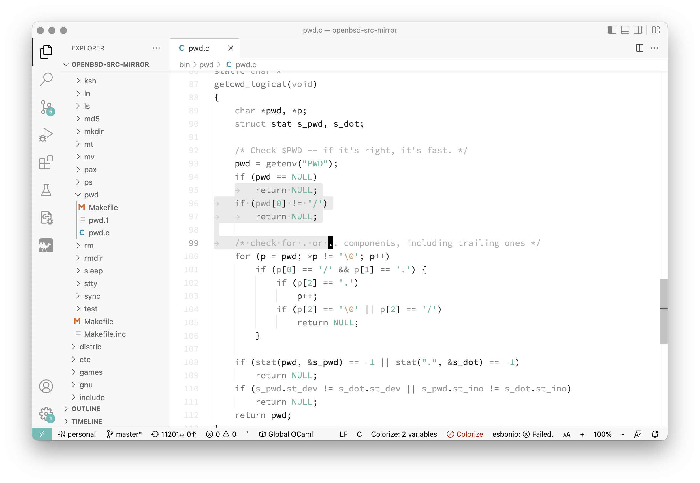
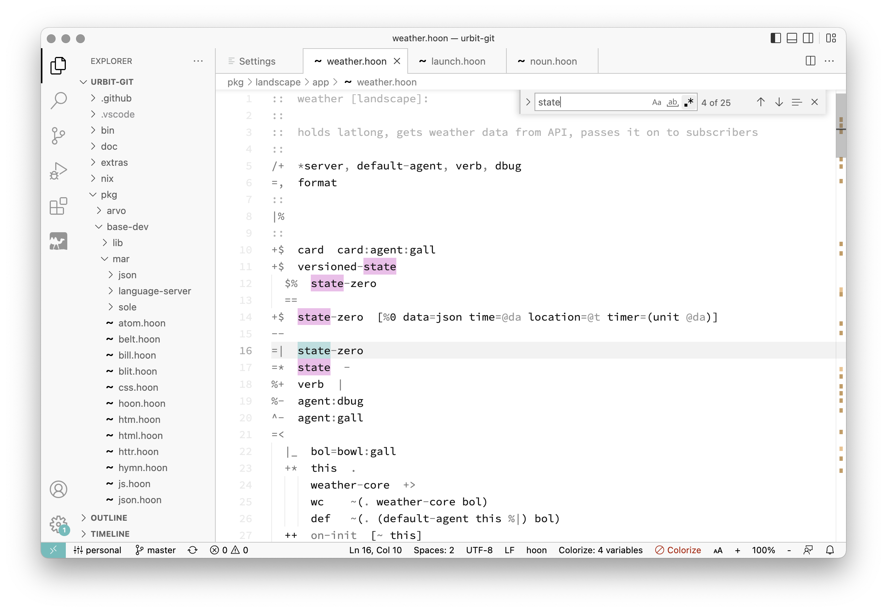

# Calm Theme

A light grayscale syntax theme with a calm and clear UI.

A single color (cyan) is used for strings and constants, and its various shades and saturations are used as accent colors throughout the editor UI.

 

## Why?

- I find syntax highlighted with few colors less confusing than syntax highlighted with many colors.
- Light-colored themes tend to make it easier for my eyes to focus on the text.
- For UI elements such as search, popup boxes, etc., I find strong colors with decent contrast to be the most helpful.
