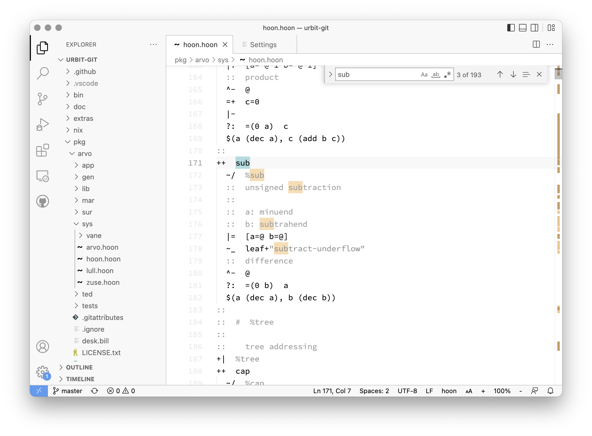
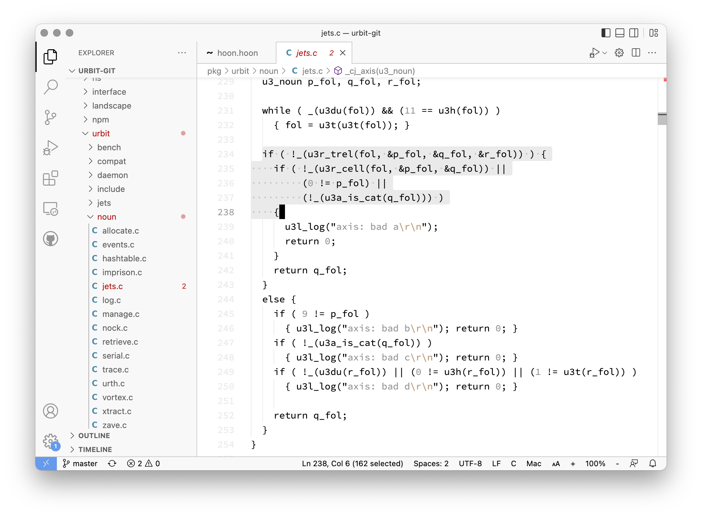

# Calm Theme

A light theme with minimal syntax highlighting and calm, clear colors.

 

Syntax highlighting is enabled for the following:

| syntax element  | color      |
| --------------- | ---------- |
| comment         | gray       |
| docstring       | slate gray |
| constant        | slate gray |
| type            | slate gray |
| string          | slate gray |
| escape sequence | brown      |
| regex           | brown      |

For now, it's helpful enough to have the same color for multiple different syntax elements. I am more concerned with seeing the structure of the text than I am with remembering what each color signifies.

## Why?

- I find syntax highlighted with few colors less confusing than syntax highlighted with many colors.
- Light-colored themes tend to make it easier for my eyes to focus on the text.
- For UI elements such as search, popup boxes, etc., I find strong colors with decent contrast to be the most helpful.

